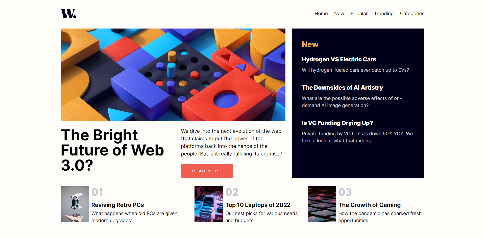

# Frontend Mentor - News homepage solution

This is a solution to the [News homepage challenge on Frontend Mentor](https://www.frontendmentor.io/challenges/news-homepage-H6SWTa1MFl). Frontend Mentor challenges help you improve your coding skills by building realistic projects. 

## Table of contents

- [Overview](#overview)
  - [The challenge](#the-challenge)
  - [Screenshot](#screenshot)
  - [Links](#links)
- [My process](#my-process)
  - [Built with](#built-with)
  - [What I learned](#what-i-learned)
- [Author](#author)
- [Acknowledgments](#acknowledgments)

## Overview

The News Blog Page is a dynamic web application that allows users to browse and read the latest news articles and blog posts. The page is designed to provide an intuitive and engaging user experience, showcasing a variety of news topics and content. Users can easily navigate through different categories, search for specific articles, and explore featured content. The responsive layout ensures that the page looks and functions well across different devices, including desktops, tablets, and mobile phones. With an attractive and user-friendly interface, the News Blog Page offers a seamless experience for users to stay informed and engaged with the latest news and blog updates.

### The challenge

Users should be able to:

- View the optimal layout for the interface depending on their device's screen size
- See hover and focus states for all interactive elements on the page

### Screenshot

### Links

- Solution URL: [Solution Repository](https://github.com/wolfgunblood/new-homepage)
- Live Site URL: [Live Demo](https://wolfgunblood.github.io/new-homepage/)

## My process

### Built with

- Semantic HTML5 markup
- CSS custom properties
- Flexbox
- CSS Grid
- Mobile-first workflow
- [React](https://reactjs.org/) - JS library

### What I learned

- Building the news blog page taught me how to design and structure a visually appealing user interface.
- I gained experience in integrating and consuming APIs to fetch real-time news data for display.
- Implementing search and filtering functionality enhanced my skills in providing users with efficient ways to navigate and find specific articles.
- Creating responsive layouts allowed me to ensure that the news blog page is accessible and functional on various devices and screen sizes.
- I learned how to optimize the performance of the page by efficiently handling and rendering large amounts of news content.
- Working on the news blog page improved my understanding of front-end frameworks like React and their role in building interactive and dynamic web applications.
- I acquired knowledge of CSS styling techniques to enhance the visual presentation of the news blog page.
- Collaborating with others on the project enhanced my skills in version control and teamwork.
- Troubleshooting and debugging issues that arose during the development process improved my problem-solving abilities.
- Lastly, I gained a deeper understanding of the importance of user experience and how to create a seamless and enjoyable browsing experience for news readers.

## Author

- Website - [Jalaj Doraiburu](https://wolfgunblood.github.io/portfolio/)
- Frontend Mentor - [@wolfgunblood](https://www.frontendmentor.io/profile/wolfgunblood)
- Twitter - [@jalaj_dorai](https://twitter.com/jalaj_dorai)

## Acknowledgments

I would like to express our gratitude to Frontend Mentor (https://www.frontendmentor.io) for providing the design and inspiration for this project. Frontend Mentor offers a vast collection of design challenges and projects that allow developers to enhance their skills by building real-world applications.
